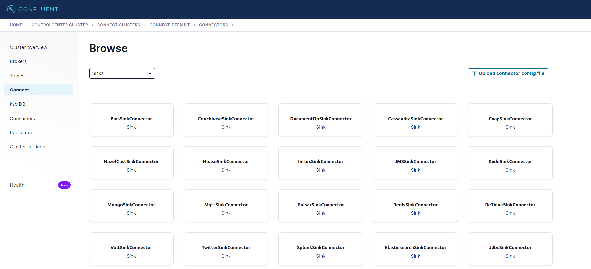

# Contributing to the Kafka EMS Sink project

## Local dev environment

This project top-level folder contains a [docker-compose file](docker-compose.yml) allowing to run locally a Kafka broker,
Schema-Registry, Kafka-connect (via [Fast Data Dev](https://github.com/lensesio/fast-data-dev)) and Confluent [Control Center](https://docs.confluent.io/platform/current/control-center/index.html) as a UI. 
This is intended to facilitate exploratory testing the connector.

In order for Kafka Connect to discover the connector, before running `docker-compose` you will have to set the environment variable
`CONNECTOR_PATH` to an absolute path pointing at a directory containing the EMS Kafka sink jar.

```bash
# assuming you have previously run `sbt assembly`
export CONNECTOR_PATH=$PWD/connector/target/scala-2.13/
```

With the above variable set, running `docker-compose up` should spin up two containers. After a few seconds, you should be
able to access Confluent Control Center by pointing your browser to `http://localhost:9024`.

From there, you can run a new connector instance by navigating to `Connect Clusters > Connect Default > Add Connector` and picking `EmsSinkConnector` from the list of available connectors.



Please refer the [Examples](https://github.com/celonis/kafka-ems-connector/wiki/Examples) wiki entry for ready to use configuration snippets covering most common use cases.

**Tip:** If you do not see `EmsSinkConnector` in the list, verify that `CONNECTOR_PATH` points to an existing folder on the docker host, 
and contains the expected standalone jar.

## Key connector components

The following sections is an attempt at walking new contributors through the key components of the EMS Kafka Sink
codebase.

_WARNING!:_ The information in this document is likely to eventually go out of sync with the implementation, so always refer the actual source code to validate it!

### The configuration system

The EMS sink taps into Kafka Connect built-in configuration system to expose a set of properties
to its users. Such configuration system provides a basic validation via a canonical
Kafka Connect endpoint whereby users can interactively check their connector properties 
before actually running the connector.

In order to introduce new configuration properties, you will have to:

- Appending a new property definition in `EmsSinkConfigDef.config`. A definition consists of the property name, its inline documentation text, its type, and default value and allow for the Kafka Connect framework to parse and validate the property value.
- Extend the `EmsSinkConfig` case class (or child classes) with a new field exposing the parsed property value to the internal connector logic.

The mapping from Kafka connect properties to the `EmsSinkConfig` case class happens in the `EmsSinkConfig.from` method,
which is also a good place to handle incompatible properties and perform overrides (e.g. we override `tmp.dir` when is `inmemfs.enable` true).

### Writing Parquet files

The connector "buffers" batches of outgoing records in temporary Parquet files which get periodically uploaded to
EMS (via CBP) and then - depending on configuration - cleaned or renamed. The entry point component into such a file-based record buffering logic is the `ems.storage.WriterManager` class.

While there will always be effectively only one running instance of this class for each individual connector Instance, `WriterManager` will dispatch the operation of writing incoming
records to the appropriate `Writer` instance, depending on the incoming record partition (i.e. there will be as many writer as the number of partitions in the source topic).
The intent is to parallelize the ingestion by accumulating and uploading one parquet file for each topic partition.

### Record transformations

#### Schema Inference

WARN about key limitations

#### Record flattening

#### Chunked JSON blobs

#### Obfuscation of sensitive fields


## Main program flow
