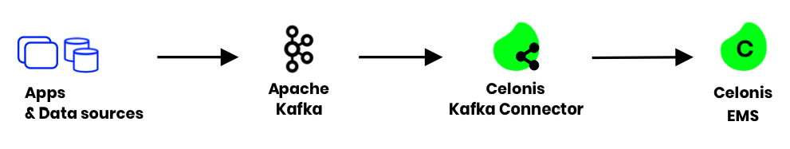

# Celonis EMS Kafka connector



## Introduction
A Kafka Connect sink connector allowing data stored in Apache Kafka to be uploaded to Celonis Execution Management System (EMS) for process mining and execution automation.

## Full Documentation

See the [Wiki](https://github.com/celonis/kafka-ems-connector/wiki) for full documentation, examples, operational details and other information.

## Requirements

Apache Kafka at least 2.3 version and a Kafka Connect cluster.


## Compile, Test and Package

The project uses sbt builds for scala 2.13.
Starting with Kafka 2.6 there is one build supporting 2.13

```shell
sbt compile
sbt test
sbt assembly
```

Last command builds the connector artifact as a single jar. The file can be found:

```shell
--connector
 ├ target
   ├scala-2.13
      └ kafka-ems-sink-assembly-1.1-SNAPSHOT.jar
```

## Installation

### Manual

* Download the connector ZIP file. If you're running Kafka version 2.5 or lower, use the 2.12 archive otherwise use the 2.13 one.
* Extract the ZIP file contents and copy the contents to the desired location. For example, you can create a directory named <path-to-kafka-instalation>/share/kafka/plugins then copy the connector plugin contents.
* Add this to the plugin path in your Connect worker properties file. Kafka Connect finds the plugins using its plugin path. A plugin path is a comma-separated list of directories defined in the Kafka Connect worker's configuration. This might already be set up and therefore there is nothing to do.
  For example:
```
plugin.path=/usr/local/share/kafka/plugins
``` 

* Start the Kafka Connect workers with that configuration. Connect will discover all connectors defined within those plugins.
* Repeat these steps for each machine where Connect is running. Each connector must be available on each worker.


## Sample connector configuration

Here is a sample configuration for the connector:

```
name=kafka2ems
connector.class=com.celonis.kafka.connect.ems.sink.EmsSinkConnector
tasks.max=1
key.converter=org.apache.kafka.connect.storage.StringConverter
value.converter=org.apache.kafka.connect.json.JsonConverter
topics=payments 
connect.ems.endpoint=https://***.***.celonis.cloud/continuous-batch-processing/api/v1/***/items
connect.ems.target.table=payments
connect.ems.connection.id=****
connect.ems.commit.size.bytes=10000000
connect.ems.commit.records=100000
connect.ems.commit.interval.ms=30000
connect.ems.tmp.dir=/tmp/ems
connect.ems.authorization.key="AppKey ***"
connect.ems.error.policy=RETRY
connect.ems.max.retries=20
connect.ems.retry.interval=60000
connect.ems.parquet.write.flush.records=1000
connect.ems.debug.keep.parquet.files=false
```
The full list of configuration keys can be found in the wiki.


## Bugs and Feedback
For bugs, questions and discussions please use the GitHub Issues.
